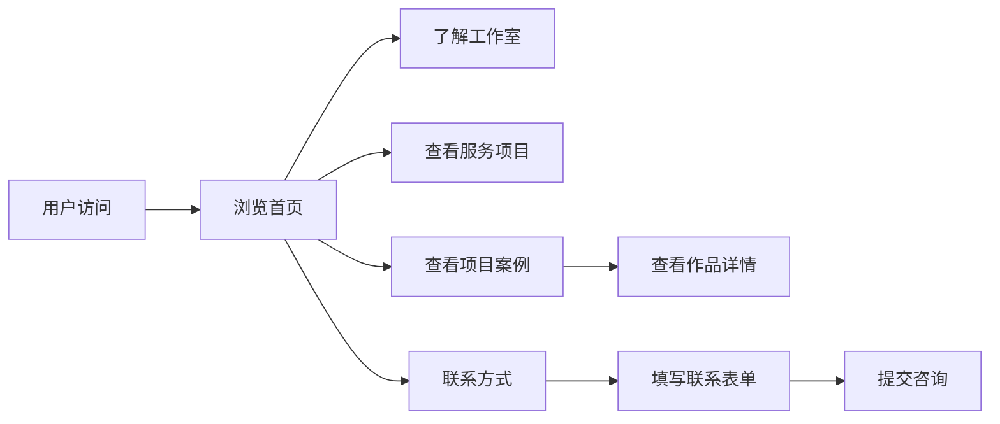

# 拾雾工作室（MistWeftStudio）官网 - 产品需求文档

## 1. Product Overview
拾雾工作室官方网站，展示工作室的创作理念、项目作品和联系方式，为潜在客户和合作伙伴提供了解工作室的窗口。
- 目标用户：潜在客户、合作伙伴、关注者
- 市场价值：建立品牌形象，展示创作能力，促进业务合作

## 2. Core Features

### 2.1 User Roles
| Role | Registration Method | Core Permissions |
|------|---------------------|------------------|
| 访客 | 无需注册 | 浏览网站内容，查看联系方式 |

### 2.2 Feature Module
1. **首页（简介）**: Hero区域、工作室介绍、创作理念、服务项目
2. **项目案例**: 项目展示、作品分类、项目详情
3. **联系方式**: 联系表单、社交媒体链接、合作咨询

### 2.3 Page Details
| Page Name | Module Name | Feature description |
|-----------|-------------|---------------------|
| 首页 | Hero区域 | 动态背景效果，工作室名称和口号展示 |
| 首页 | 工作室介绍 | 团队简介、创作理念展示 |
| 首页 | 服务项目 | 游戏制作、微电影拍摄、文学创作、短视频创作介绍 |
| 项目案例 | 项目列表 | 作品分类展示（目前为空，预留展示位） |
| 联系方式 | 联系表单 | 姓名、邮箱、留言输入框 |
| 联系方式 | 社交链接 | 微信、QQ、B站等社交媒体跳转 |

## 3. Core Process
用户访问网站 → 浏览首页了解工作室 → 查看项目案例 → 通过联系方式提交合作咨询

## 4. User Interface Design

### 4.1 Design Style
- **主色调**: 深邃的雾蓝色（#1a1f35）搭配银色渐变（#c0c0c0），营造神秘、文艺的氛围
- **辅助色**: 金色点缀（#d4af37）用于强调和CTA按钮
- **按钮风格**: 简约圆角，hover时有发光效果
- **字体**: 中文使用"思源宋体"，英文使用"Playfair Display"，打造文艺复古感
- **布局**: 非对称布局，大量留白，突出内容
- **图标**: 使用线条简洁的图标，配合雾效果

### 4.2 Page Design Overview
| Page Name | Module Name | UI Elements |
|-----------|-------------|-------------|
| 首页 | Hero区域 | 全屏背景、悬浮标题、渐变遮罩、粒子效果 |
| 首页 | 工作室介绍 | 卡片式布局、图文混排、引用块 |
| 首页 | 服务项目 | 四宫格卡片、hover动画、图标展示 |
| 项目案例 | 项目列表 | 网格布局、卡片悬停效果、占位提示 |
| 联系方式 | 联系表单 | 简洁表单、发送按钮动画 |

### 4.3 Responsiveness
- **桌面端**: 完整多列布局，丰富动效
- **平板端**: 自适应两列布局
- **移动端**: 单列布局，汉堡菜单导航

### 4.4 3D Scene Guidance
- 使用CSS 3D变换和粒子效果模拟"雾"的氛围
- 背景使用渐变叠加噪点纹理
- 页面元素具有轻微的视差滚动效果
