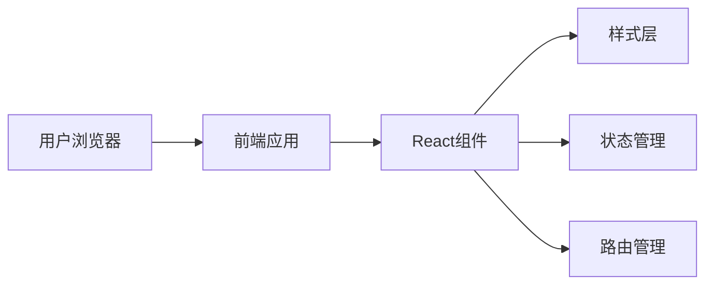

# 拾雾工作室（MistWeftStudio）官网 - 技术架构文档

## 1. Architecture Design


## 2. Technology Description
- **Frontend**: React@18 + TypeScript + TailwindCSS@3 + Vite
- **Initialization Tool**: vite-init (react-ts template)
- **Backend**: None (纯静态网站，无需后端)
- **Database**: None (暂无动态数据需求)
- **Icon Library**: lucide-react
- **Animation**: CSS Animations + Framer Motion

## 3. Route Definitions
| Route | Purpose |
|-------|---------|
| / | 首页（包含简介、服务项目） |
| /projects | 项目案例页 |
| /contact | 联系方式页 |

## 4. API Definitions
无需后端API，纯静态网站

## 5. Project Structure
```
src/
├── components/
│   ├── Header.tsx          # 导航栏组件
│   ├── Hero.tsx            # Hero区域组件
│   ├── About.tsx           # 工作室介绍组件
│   ├── Services.tsx        # 服务项目组件
│   ├── Projects.tsx        # 项目案例组件
│   ├── Contact.tsx         # 联系表单组件
│   └── Footer.tsx          # 页脚组件
├── pages/
│   ├── Home.tsx            # 首页
│   ├── ProjectsPage.tsx    # 项目案例页
│   └── ContactPage.tsx     # 联系方式页
├── App.tsx                 # 根组件
├── main.tsx                # 入口文件
└── index.css               # 全局样式
```

## 6. Data Model
无需数据库，所有内容通过组件静态渲染

## 7. Key Design Features
### 7.1 视觉效果
- 雾效背景：使用CSS渐变和模糊滤镜模拟雾的效果
- 粒子动画：页面加载时的浮动粒子效果
- 视差滚动：背景与内容的轻微视差
- 玻璃拟态：卡片使用backdrop-filter实现毛玻璃效果

### 7.2 交互效果
- 导航栏滚动时背景变化
- 卡片hover时的缩放和阴影效果
- 页面平滑滚动
- 表单提交动画

### 7.3 响应式设计
- 移动端适配（375px+）
- 平板适配（768px+）
- 桌面端（1200px+）
